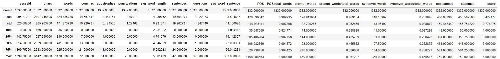
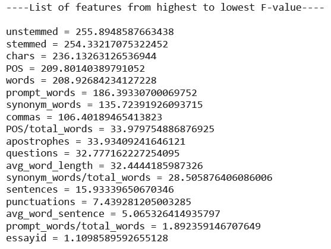
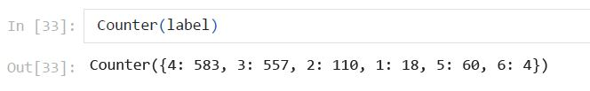
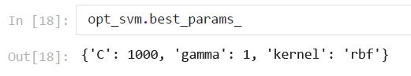
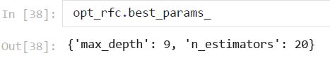
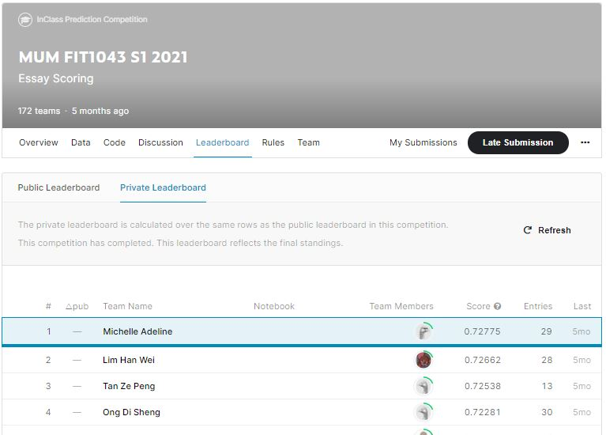
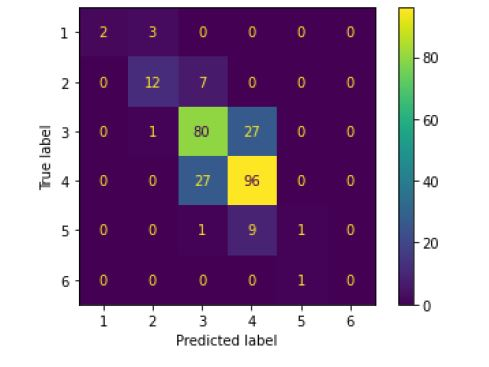
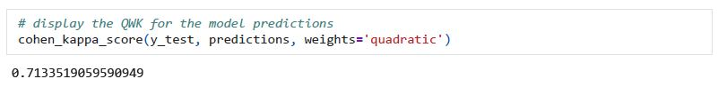
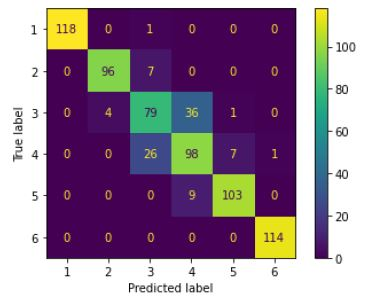
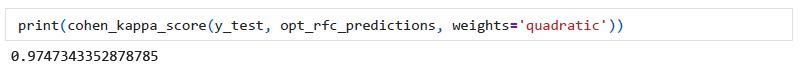

Automated Essay Scoring
=======================

## Table of contents
* [About](#about)
* [Dataset](#dataset)
* [Process](#process)
* [Kaggle Placement](#kaggle-results)
* [Results](#results)
* [Libraries](#libraries)

## About
Motivation - Interest in the possibility of using machine learning algorithms to judge and grade essays similar to a human marker. This particular avenue has massive implications for the future of education as it might lessen the workload for already-overburdened teachers and is possibly more fair as using a model to give out scores removes doubt on any favouritism that may be given to a particular student by a teacher.

Preprocessed data derived from a set of essays (feature selection, normalization, oversampling), then conducted predictive analysis using machine learning models such as SVMs and ensemble classifiers such as Random Forest Classifiers. At the end, the various models' accuracies are evaluated with the help of a confusion matrix and a quadratic kappa score. The best model was submitted to a Kaggle competition, and **placed first among 172 participating teams!**

## Dataset
The dataset used for this project was obtained from a [popular Kaggle competition](https://www.kaggle.com/c/asap-aes) sponsored by the Hewlett Foundation.
It includes the following information for each essay (and more):
* essay id
* number of characters, words, sentences, questions
* number of punctuations (commas, apostrophes, other punctuations)
* POS (total Part-Of-Speech discovered)
* average length of words, sentences
* words related to prompt
* synonymous words
* stemmed, unstemmed word count

## Process

### Analysis of dataset
The following table displays descriptive statistics for each of the provided essay features. Things of note:
* The average score of an essay is 3.4 and the median is 3.0. As scores range from 0 to 6, this result provides some evidence that the scores are normally distributed.
* There is a very large range of 642 between the essay with the most number of sentences and the essay with the least number of sentences
* There is a very large range of 302 between the essay with the highest average number of words per sentence and the essay with the lowest number of words per sentence.

### Feature Selection
We are provided with 18 features from the dataset, some of which clearly have no association with their score (for example: essayid). Thus I perform feature selection to keep only the most relevant features and to speed up training.

This feature selection is done with the help of ANOVA (Analysis Of Variance). For each of the features, I compute the ANOVA F-value. The results are shown below:

With a bit of experimentation, I obtained the best results keeping only those features with an F-value above 100 which are:
* stemmed, unstemmed word count
* character and word count
* POS (total Part-of-Speech discovered)
* words related to prompt
* number of commas
* number of synonymous words used

### Normalization/Scaling
Normalization/Scaling is an important step in preprocessing especially when different features have vastly different ranges and may unfairly dominate over other features. I used the min-max scaler to perform scaling (scaled to [0,1]) as it preserves the shape of the original distribution while avoiding significantly altering the information embedded in the original data.

### Oversampling
One thing I noticed about the dataset is the rarity of essays scored 1 or 6, i.e. either extremes. This is to be expected as the distribution of grades typicaly follow a bell curve, or normal distribution. This resulted in the model practically never predicting 1s or 6s as they happen so rarely, as shown in the frequency count below which shows that there are 583 essays that scored a 4 which makes up 43.8% of the total essays whereas there are only a mere 4 essays with a score of 6, this amounts to 0.45% of total essays.

To combat this I can oversample these minority classes by using the Syntethic Minority Oversampling Technique (SMOTE) which synthesizes new examples for these minority classes from existing ones. We can see the results of this oversampling in the [confusion matrix for the Random Forest Classifier](#confusion-matrix-for-random-forest-classifier)

### Building SVM Model
Hyperparameter Tuning - tested accuracy of model for various combinations of hyperparameters:
* kernel - the type of kernel to be used in the algorithm (linear vs rbf)
* C -  regularization parameter which tells the algorithm how important misclassified points are
* gamma - the kernel coefficient, it decides the level of influence of a single example

Combination that led to the highest accuracy:

### Building RFC Model
Hyperparameter Tuning - similar to building the SVM model, here I look for the best combination of hyperparameters:
* n_estimators - the number of trees to use
* max_depth - the maximum depth of a tree

Combination that led to the highest accuracy:

## Kaggle Results
With the model built from the Random Forest Classifier, I **won the Kaggle competition with 172 participating teams**.
[Full leaderboard](https://www.kaggle.com/c/mum-fit1043-s1-2021/leaderboard)

## Results

### SVM model (Confusion Matrix)

### SVM model (Quadratic Kappa Score)

### Confusion Matrix for Random Forest Classifier
Note: Performed oversampling, thus total number of samples is greater in comparison to the SVM Confusion Matrix, the goal here is to correctly classify infrequent scores (1 and 6)

### RFC model (Quadratic Kappa Score)
Note: Much better QWK score in comparison to the SVM model!

## Libraries
* scikit-learn (sklearn)
* imbalanced-learn (imblearn)
* pandas
* numpy
